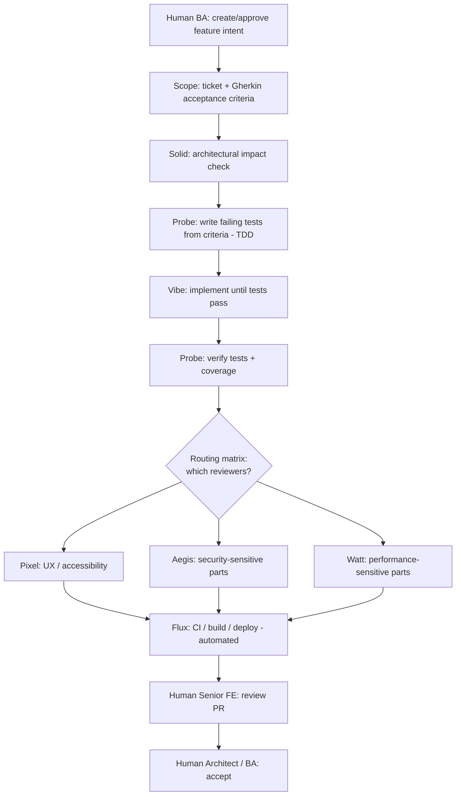

# Delivery Workflow & Review Routing

How a change moves from intent to `main`, and **who reviews what**. This is the steering
model for the hybrid (human + AI) team. It extends the working method in
[`AGENTS.md`](../AGENTS.md) and the PR rules in
[`conventions/git-and-pull-requests.md`](conventions/git-and-pull-requests.md).

> **Principle:** not every agent reviews every change. Over-review is as costly as
> under-review. Use the [routing matrix](#review-routing-matrix) to invoke only the reviewers
> a change actually needs.

## Steering model (happy path)

**Notes**

- **TDD, not test-after:** Probe authors the failing tests _before_ Vibe implements, then
  confirms coverage after. (This is why Probe appears twice above.)
- **Solid's up-front check is lightweight** — a go/no-go on architectural impact and whether an
  ADR is needed, _before_ implementation, not a second full review.
- **Flux is automated** — the [CI pipeline](../.github/workflows/ci.yml) runs on every PR; no
  manual step.
- **Humans have the final word** — AI teammates propose; a human Senior FE reviews and a human
  Architect/BA accepts. Nothing merges without both.

## Review routing matrix

Invoke only the required virtual reviewers for the change type. **Every** PR additionally gets
the automated CI gate (Flux) and the two human gates.

| Change type                                                     | Required virtual reviewers                           |
| --------------------------------------------------------------- | ---------------------------------------------------- |
| New page                                                        | Vibe, Probe, Pixel                                   |
| New API integration                                             | Vibe, Probe, Aegis                                   |
| Auth / session change                                           | Solid, Aegis, Probe                                  |
| CI/CD change                                                    | Flux, Aegis                                          |
| Design-system change                                            | Pixel, Solid, Probe                                  |
| Architecture / dependency change                                | Solid, Aegis, Flux                                   |
| Complex form                                                    | Vibe, Probe, Pixel — **+ Aegis** if PII/auth/payment |
| Performance-sensitive change                                    | Watt, Probe                                          |
| _(large lists, editors, real-time views, new heavy dependency)_ |                                                      |
| Docs-only change                                                | _none required_ (human review optional)              |

If a change spans several types, take the **union** of reviewers.

## How each layer is enforced

- **Human gates + path routing → automated.** [`.github/CODEOWNERS`](../.github/CODEOWNERS) maps
  paths to human owners so GitHub auto-requests the right human reviewers; branch protection makes
  their approval required.
- **CI gate (Flux) → automated.** The Actions workflow runs type-check, lint, test, build, and the
  bundle/audit gates on every PR.
- **Virtual reviewers → procedure, with automation.** Virtual teammates are not GitHub accounts,
  so the author declares the change type in the [PR template](../.github/pull_request_template.md).
  Each teammate is a Claude Code **subagent** in [`.claude/agents/`](../.claude/agents/) (read-only,
  pointing at its [role card](agents/)). Run the **`/route-review`** command
  ([`.claude/commands/route-review.md`](../.claude/commands/route-review.md)) to auto-detect the
  change type, dispatch exactly the required reviewers against the diff, and get a consolidated
  report. The reviewers advise; humans still approve.

## What "review" means per role

Each reviewer applies its own [role card](agents/) and the relevant
[convention](conventions/): Solid → boundaries/ADRs; Vibe → coding standards; Probe → test
coverage & quality; Pixel → Figma fidelity + a11y; Aegis → OWASP; Flux → pipeline; Watt →
performance budgets.
